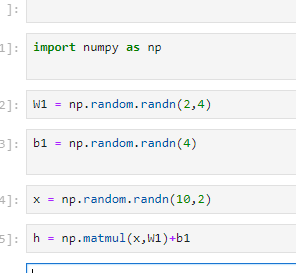

# 1. 신경망 복습
- 이 책은 밑시딥의 속편으로 딥러닝의 가능성을 한층 더 깊게 탐험할 것이다.
- 이번 장에서는 신경망을 복습할 것이다.
- 효율을 높히고자 전편에서의 구현 규칙을 일부 변경하겠다

## 1.1 수학과 파이썬 복습

- 수학적 지식으로는 벡터 나 행렬 등을 알아야한다.
- 신경망을 원활하게 구현하기  위한 파이썬 코드 특히 넘파이를 사용한 코드도 리뷰한다.

### 1.1.1 벡터와 행렬

- 신경망에서는 벡터와 행렬 또는 텐서가 도처에서 등장한다.
- 벡터는 크기와 방향을 가진 양이다.
- 벡터는 숫자가 일렬로 늘어선 집합으로 표현할 수 있고 파이썬에서는 1차원 배열로 취급이 가능하다.
- 행렬은 숫자가 2차원 형태로 늘어선 것이다.

- 이것은 행렬이다.

- 이건 벡터다.

- 수학과 딥러닝등 많은 분야에서 열벡터 방식을 선호하지만 여기서 구현 편의를 위해 행벡터로 다루겟다.

- 수식에서의 벡터나 행렬은 X와 W 처럼 굵게 표기하여 단일 원소로 이루어진 스칼라 값과 구별한다.

- 코드에서 보듯이 벡터와 행렬은 np.array() 메서드로 생성할수 있다. 

- 이 메서드는 넘파이의 다차원 배열 클래스인 np.ndarray 클래스를 생성한다.

- np.ndarray 클래스에는 다양한 편의 메서드와 인스턴스 변수가 준비되어 있다.

- 위 코드에서는 shape 와 ndim을 이용했다.

### 1.1.2 행렬의 원소별 연산

- 이번에는 표현한 벡터와 행렬을 사용해 간단한 계산을 할것이다.

### 1.1.3 브로드 캐스트

- 넘파이의 다차원 배열에서는 형상이 다른 배열 끼리도 연산이 가능하다.

- 10이 앞의 크기에 맞춰 증식 하는것이 브로드 캐스트 이다.

- 브로드 캐스트의 또 다른 예는 다음과 같다.

### 1.1.4 벡터의 내적과 행렬의 곱

- 벡터의 내 수식은 다음과 같다.

- 여기서 2개의 벡터 x와 y가 있다고 가정한다. 그리고 식 1.1에서 보듯 벡터의 내적은 두 벡터에서 대응하는 원소들의 곱을 모두 더한것이다.

- 행렬의 곱은 다음과 같다.

- 벡터의 내적과 행렬의 곱을 파이썬으로 구현하면 다음과 같은 코드가 나온다.
- 넘파이의 np.dot() 과 np.matmul() 메서드를 이용하면 쉽게 구현이 된다.

- 넘파이를 익히는데는 실제로 코딩해보면서 연습하는게 가장 좋다. 넘파이 경험을 쌓고싶은 사람은 100 numpy excercises 사이트를 추천한다.

### 1.1.5 행렬 형상 확인

- 행렬이나 벡터를 사용해 계산할 때는 그 형상에 주의해야한다.

- 그림 1-6 과 같이 형상확인이 중요하다

## 1.2 신경망의 추론

- 신경망을 복습할 차례이다.
- 신경망에서 수행하는 작업은 학습과 추론이다. 이번절에서는 신경망 추론에 집중하고 학습은 다음 절에서 다룬다.

### 1.2.1 신경망 추론 전체 그림

- 신경망은 간단히 말하면 단순한 함수 라 할수 있다.
- 함수는 무엇인가를 입력하면 무엇인가를 출력하는 변환기 이다.
- 신경망도 함수처럼 입력을 출력으로 변환한다.

- 이번 절에서는 2차원 데이터를 입력하여 3차원 데이터를 출력하는 함수를 예로 들겠다
- 이 함수를 신경망으로 구현하려면 입력층에는 뉴런 2개를 출력층에는 3개를 각각 준비한다.

- 그리고 은닉층에 적당한 수의 뉴런을 배치한다.
- 그러면 그림 1-7과 같이 그림을 그릴수 있다.

- 화살표에는 가중치와 뉴런의 값을 곱한다음 바이아스를 더해서 활성화 함수를 적용한 값이 다음 뉴런의 입력이 된다.
- 인접하는 층의 모든 뉴런과 연결 되어 있다는 뜻에서 완전 연결 계층 이라고 한다.
- 이건 2층 신경망이다.

- 식 1-2와 같이 은닉층의 뉴런은 가중치의 합으로 계싼 된다.

- 이것을 행렬로 한꺼번에 계산하면 다음과 같다.

- 그림 1-8 과 같이 행렬의 곱에서는 대응하는 차원의 원소 수가 일치해야한다.

- 신경망의 추론이나 학습에서는 다수의 샘플 데이터를 한꺼번에 처리한다.
- 그럴라면 행렬 x의 각 행 각각에 데이터를 저장해야한다
- N개의 샘플 데이터를 미니배치로 한꺼번에 처리한다면 그림 1-9 처럼 된다.

 - 완전 연결 계층에 의한 변환의 미니배치 버전을 파이썬으로 해본다.
 

 - 이 완전연결 계층에 의한 변환은 선형 변환이다 여기서 비선형 효과를 부여하는것이 활성화 함수이다.
 - 여기에서는 식 1-5인 시그모이드 함수를 사용한다.

 

 - 시그모이드는 다음 그림과 같다.

- 시그모이드 함수는 임의의 실수를 입력받아 0에서 1 사이의 실수를 출력한다.

- 이것을 파이썬으로 구현해 본다.

- 이 시그모이드를 사용하여 방금 전의 은닉층 뉴런을 변환한다.

- 활성화 함수의 출력인 a(이를 활성화 라고 한다)를 다른 완전 연결 계층에 통과시켜 변환한다.

- 종합한 파이썬으로 작성해본다.
- 여기서 x의 형상은 10,2이다, 데이터 10개가 미니배치로 처리된다는 것이다.
- 최종 출력인 s의 형상은 (10,3)이다.

- 이 신경망은 3차원 데이터를 출력한다 따라서 각 차원의 값을 이요ㅕㅇ하여 3클래스 분류를 할수있다.

- 출력된 3차원 벡터의 각 차원은 각 클래스에 대응하는 점수가 된다.

### 1.2.2 계층으로 클래스화ㅣ 및 순전파 구현

- 신경망에서 하는 처리를 계층layer로 구현해본다

- 완전연결계층에 의한 변환을 Affine 계층으로, 시그모이드 함수에 의한 변환을 sigmoid 계층으로 구현할 것이다.
- 완전연결 계층에 의한 변환은 기하학에서의 아핀 변환에 해당하기 때문에 Affine 계층 이라고 지어ㅗㅆ다.

- 신경망에는 다양한 계층이 등장하는데 이 계층을 모두 파이썬 클래스로 구현할 것이다.

- 이 책에서는 이러한 계층을 구현할 때 다음의 구현 규칙을 따른다.
- 모든 계층은 forward() 와 backward()매서드를 가진다
- 모든 계층은 인스턴스 변수인 params 와 grads 를 가진다.

- forward 와 backward는 순전파와 역전파를 수행한다.
- params 는 가중치와 편향같은 매개변수를 담는 리스트이다.
- 마지막으로 grad는 params 에 저장된 각 매개변수에 대응하여 해당 매개변수의 기울기를 보관하는 리스트이다.

- 이번 절에서는 순전파만 구현할 것이므로 규칙 2개만 적용하겟다.