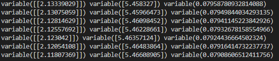
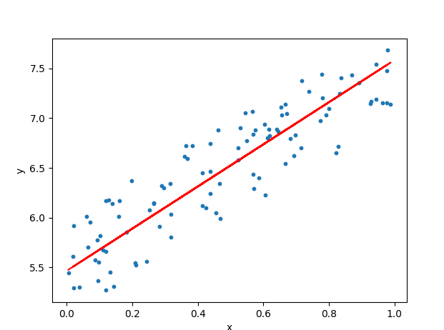

# step 42 선형 회귀
- 머신러닝은 '데이터'를 사용하여 문제를 해결한다.
- 따라서 모아진 데이터로 컴퓨터가 학습을 진행해 답을 찾는것.
- DeZero를 사용하여 머신러닝 문제를 해결해 본다.

## 42.1 토이 데이터셋
- 실험용으로 작은 데이터 셋을 만든다.
- 생성 될때마다 같은 값을 만들기 위해 시드값을 고정해서 생성
```python
import numpy as np
import matplotlib.pyplot as plt

np.random.seed(0)
x = np.random.rand(100, 1)
y = 5 + 2 * x + np.random.rand(100, 1)

plt.plot(x,y,'o')
plt.show()
```


## 42.2 선형 회귀 이론

- 목표는 주어진 데이터를 잘 표현하는 함수 찾기이다.
- 여기에서는 x와 y가 선형 관계라고 가정을 해서 y = Wx + b 라는 식으로 표현이 가능하다.
- 이 식은 다음 그림과 같이 직선을 그린다.


- 그러기 위해 데이터와 예측치의 차이 즉 잔차(residual)을 최소화 해야한다.

- 예측치(모델)과 데이터의 오차를 나타내는 지표를 다음 식으로 정의


- 식 42-1은 총 N개의 점에 대해 각 점에서 제곱 오차를 구한다음 모두 더하고 N으로 나눠 평균을 구한다.(평균 제곱 오차)(mean squared error)
- 이 오차를 모델 성능이 얼마나 나쁜지 평가할수 있다.
- 우리의 목표는 손실함수의 값을 최소화 하는 W와 b를 찾는것
- 28단계에서 함수 최적화 문제를 경사하강법을 이용하여 풀었다

## 42.3 선형 회귀 구현

- 이제 DeZero를 이용해서 선형 회귀를 구현해 본다.
- 전반부 코드는 다음과 같다.
```python
import numpy as np
from dezero import Variable
import dezero.functions as F

np.random.seed(0)
x = np.random.rand(100,1)
y = 5 + 2 * x + np.random.rand(100,1)
x,y = Variable(x), Variable(y) #생략가능

W = Variable(np.zeros((1,1)))
b = Variable(np.zeros(1))

def  predict(x):
    y = F.matmul(x,W) + b
    return y
```
- W의 형상은(1,1) 이고 b의 형상은 (1,)이다.
- predict 함수는 matmul 함수를 이용해서 행렬의 곱을 계산


- 지금은 X의 형상이 (100,1) 이므로 W의 형상이(1,1)이지만 X의 형상이 D차원이면 W의 형상은 (D,1)이 되야한다.


- 후반부 코드는 다음과 같다.

```python
def mean_squared_error(x0, x1):
    diff = x0 -x1
    return F.sum(diff ** 2) / len(diff)

lr = 0.1
iters = 100

for i in range(iters):
    y_pred = prdict(x)
    losss = mean_squared_error(y,y_pred)

W.cleargrad()
b.cleargrad()
loss.backward()

W.data -= lr * W.grad.data
b.data -= lr * b.grad.data
print(W, b, loss)
```
- 평균 제곱 오차를 구하는 함수를 mean_squared_error(x0, x1)이라는 이름으로 구현
- W,b,loss 값의 경향은 다음과 같이 나온다.

- 경사하강법으로 매개변수를 갱신했을때 나오는 그래프는 다음과 같다



## 42.4 DeZero의 mean_squared_error 함수

- DeZero에서 다음과 같이 평균 제곱 오차를 구하는 함수를 구현했다.
```python
def mean_squared_error(x0, x1):
    diff = x0 -x1
    return F.sum(diff ** 2) / len(diff)
```
- DeZero 함수를 사용하므로 미분도 가능하지만 개선할 점이 있다.


- 위의 계산 그래프를 보면 이름 없는 빈칸인 변수 3개가 존재한다.
- 이를 Function 클래스를 상속하여 구현하는 방식으로 바꾼다.

```python
class MeanSquaredError(Function):
    def forward(self, x0, x1):
        diff = x0- x1
        y = (diff ** 2 ).sum() / len(diff)
        return y

    def backward(self,gy):
        x0, x1 = self.inputs
        diff = x0 - x1
        gx0 = gy*diff *(2. / len(diff))
        gx1 = -gx0
        return gx0, gx1

    def mean_squared_error(x0,x1):
        return MeanSquaredError()(x0,x1)
```
- 순전파는 ndarray 인스턴스로 구현하고 역전파는 처리 단위를 하나로 묶어서 backward에 구현했다.
- 새로운 계산 그래프는 다음과 같다.


- 중간에 있는 변수들이 사라져 ndarray를 사용함으로써 메서드의 범위를 벗어나는 순간 메모리에서 삭제가 된다.