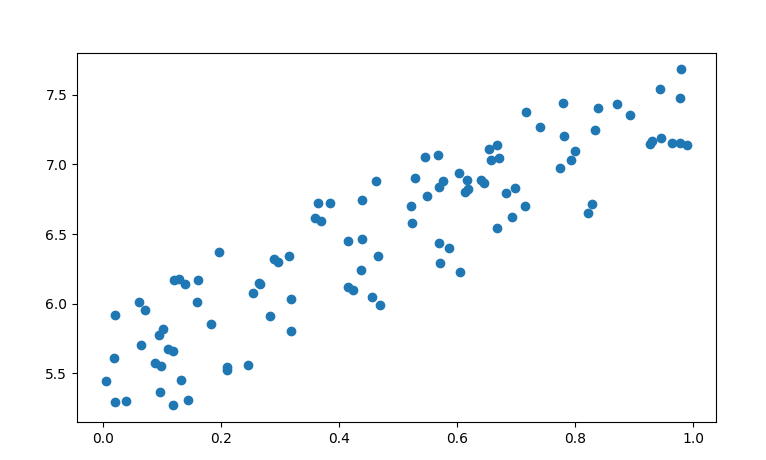

# step 42 선형 회귀
- 머신러닝은 '데이터'를 사용하여 문제를 해결한다.
- 따라서 모아진 데이터로 컴퓨터가 학습을 진행해 답을 찾는것.
- DeZero를 사용하여 머신러닝 문제를 해결해 본다.

## 42.1 토이 데이터셋
- 실험용으로 작은 데이터 셋을 만든다.
- 생성 될때마다 같은 값을 만들기 위해 시드값을 고정해서 생성
```python
import numpy as np
import matplotlib.pyplot as plt

np.random.seed(0)
x = np.random.rand(100, 1)
y = 5 + 2 * x + np.random.rand(100, 1)

plt.plot(x,y,'o')
plt.show()
```


## 42.2 선형 회귀 이론

- 목표는 주어진 데이터를 잘 표현하는 함수 찾기이다.
- 여기에서는 x와 y가 선형 관계라고 가정을 해서 y = Wx + b 라는 식으로 표현이 가능하다.
- 이 식은 다음 그림과 같이 직선을 그린다.


- 그러기 위해 데이터와 예측치의 차이 즉 잔차(residual)을 최소화 해야한다.

- 예측치(모델)과 데이터의 오차를 나타내는 지표를 다음 식으로 정의


