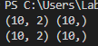

# step. 50 미니배치를 뽑아주는 DataLoader

- 이전 단계에서 Dataset 클래스를 만들어서 통일된 인터페이스로 데이터셋을 다룰수 있게 했다.
- 이번 단계에서는 Dataset 클래스에서 미니배치를 뽑아주는 DataLoader 클래스를 구현할 것이다.
- DataLoader는 미니배치 생성과 데이터셋 뒤섞기등의 기능을 제공 한다.

## 50.1 반복자란

- 반복자(iterator)는 원소를 담고있는 데이터 타입으로 부터 데이터를 순차적으로 추출하는 기능을 제공.
- 아래의 코드는 리스트 t의 원소가 하나씩 뽑혀지게된다.
```python
t = [1,2,3]
x = iter(t)
print(next(x))
print(next(x))
print(next(x))
```

- 다음의 코드는 반복자를 직접 만든다.
```python
class MyIterator:
    def __init__(self,max_cnt):
        self.max_cnt = max_cnt
        self.cnt = 0

    def __iter__(self):
        return self
    def __next__(self):
        if self.cnt == self.max_cnt:
            raise StopIteration()
        
        self.cnt += 1
        return self.cnt
```
- 클래스를 파이썬 반복자로 사용하려면 __iter__ 라는 특수 메서드를 구현하고 self 를 반환 하게 한다.
- __next__ 특수 메서드에서 다음 원소를 반환하고, 반환할 원소가 없다면 raise StopIteration()을 실행

- 이제 이것을 이용해서 미니배치를 뽑아주는 DataLoader 클래스를 구현해본다.

```python
class DataLoader:
    def __init__(self, dataset, batch_size, shuffle=True):
        self.dataset = dataset
        self.batch_size = batch_size
        self.shuffle = shuffle
        self.data_size = len(dataset)
        self.max_iter = math.ceil(self.data_size / batch_size)
        

        self.reset()

    def reset(self):
        self.iteration = 0
        if self.shuffle:
            self.index = np.random.permutation(len(self.dataset))
        else:
            self.index = np.arange(len(self.dataset))

    def __iter__(self):
        return self

    def __next__(self):
        if self.iteration >= self.max_iter:
            self.reset()
            raise StopIteration

        i, batch_size = self.iteration, self.batch_size
        batch_index = self.index[i * batch_size:(i + 1) * batch_size]
        batch = [self.dataset[i] for i in batch_index]
        x = xp.array([example[0] for example in batch])
        t = xp.array([example[1] for example in batch])

        self.iteration += 1
        return x, t

    def next(self):
        return self.__next__()
```
- dataset : Dataset 인터페이스를 만족하는 인스턴스(__getitem__ 과 __len__ 메서드를 가진 클래스로 부터 생성된 인스턴스)
- batch size : 배치 크기
- shuffle : 에포크(에포치)별로 데이터셋을 섞는지 여부
- __init__ 에서는 매개변수로 받은 데이터들을 인스턴스 변수로 저장한후 reset 메서드를 불러 반복 횟수를 0으로 설정하고 shuffle 여부에 따라 데이터를 섞는걸 진행
- __next__ 메서드는 미니배치를 꺼내 ndarray 인스턴스로 변환

## 50.2 DataLoader 사용하기

```python
if '__file__' in globals():
    import os, sys
    sys.path.append(os.path.join(os.path.dirname(__file__), '..'))
from dezero.datasets import Spiral
from dezero import DataLoader

batch_size = 10
max_epoch = 1

train_set = Spiral(train = True)
test_set = Spiral(train = False)
train_loader = DataLoader(train_set, batch_size)
test_loader = DataLoader(test_set, batch_size, shuffle= False)

for epoch in range(max_epoch):
    for x, t in train_loader:
        print(x.shape, t.shape)
        break

    for x,t in test_loader:
        print(x.shape, t.shape)
        break

```


- 훈련용과 테스트용 (x, t)의 DataLoader 를 생성
- 훈련용은 훈련을 여러번 돌려야 하므로 epoch 마다 다른 미니배치를 사용해 shuffle 진행 테스트는 테스트 데이터 한개 세트만 필요하므로 shuffle 진행 x

## 50.3 accuracy 함수 구현하기

- 이번 절에서는 인식 정확도를 평가해주는 acc함수를 추가한다.

```python
def accuracy(y,t):
    y,t = as_variable(y), as_variable(t)

    pred = y.data.argmax(axis=1).reshape(t.shape)
    result = (pred== t.data)
    acc = result.mean()
    return Variable(as_array(acc))
```

- accuracy 함수는 인수 y와 t를 받아서 정답률을 계산해준다.
- y는 신경망의 예측 결과, t는 정답 데이터이다.


