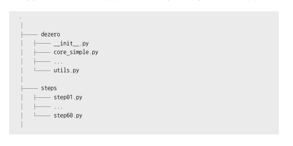

# 23 패키지로 정리

    지금까지는 단계마다 내용 전체를 파일 하나에 담았다.
    지금까지 작성한 코드를 재사용이 가능하도록 패키지로 정리할 계획

    파이썬에는 모듈 패키지 라이브러리 라는 용어를 사용한다

    모듈 : 모듈은 파이썬 파일이다 특히 다른 파이썬 프로그램에서 임포트 하여 사용하는 것을 가정하고 만들어진 파이썬 파일을 모듈 이라고 한다.

    패키지 : 패키지는 여러 모듈을 묶은것 패키지를 만들려면 먼저 디렉터리를 만들고 그 안에 모듈(파이썬 파일)을 추가

    라이브러리 : 라리브러리는 여러 패키지를 묶은 것이다. 하나이상의 드렉터리로 구성


## 23.1 파일 구성

    최종 파일 구성은 다음과 같다



    이와 같이 구성한 뒤 dezero 디렉터리에 모듈을 추가하는것이다. 

## 23.2 코어 클래스로 옮기기

    이전 단계의 step22.py 코드를 dezero/core_simple.py 라는 코어 파일로 옮긴다.

    step22.py에 정의된 다음 클래스들을 코어 파일로 복사한다.
    config, variable, Function, add, mul, neg, sub, div, pow

    다음 함수들도 코어 파일로 옮긴다
    using_config, no_grad, as_array, as_variable, add, mul, neg, sub, rsub, div,rdiv, pow

    이제 외부의 파이썬 파일에서 dezero를 임포트 할수있다.

## 23.3 연산자 오버로드

    오버로드한 연산자들을 dezero로 옮긴다.
    
```python
def setup_variable():
    Variable.__add__ = add
    Variable.__radd__ = add
    Variable.__mul__ = mul
    Variable.__rmul__ = mul
    Variable.__neg__ = neg
    Variable.__sub__ = sub
    Variable.__rsub__ = rsub
    Variable.__truediv__ = div
    Variable.__rtruediv__ = rdiv
    Variable.__pow__ = pow
```
    이 함수는 dezero/__init__.py에서 호출한다.
    따라서 __init__.py에 다음 코드를 작성해 넣는다.

```python
   from dezero.core_simple import Variable
    from dezero.core_simple import Function
    from dezero.core_simple import using_config
    from dezero.core_simple import no_grad
    from dezero.core_simple import as_array
    from dezero.core_simple import as_variable
    from dezero.core_simple import setup_variable

```


# 24 복잡한 함수의 미분

    Dezero는 이제 대표적인 연산자들(+,*,-,/,**)을 지원한다.
    이걸 이용해서 복잡한 수식의 미분을 풀어볼것이다.

    이번 단계에서 다루는 함수들은 최적화 문제에서 자주 사용되는 테스트 함수이다.

                                    

## 24.1 sphere 함수

    원을 나타내는 함수인 z = x **2 + y **2 를 미분한 값이다.

```python
x = Variable(np.array(1.0))
y = Variable(np.array(1.0))
z = sphere(x,y)

z.backward()
print(x.grad,y.grad)
```
    를 출력하면 2.0으로 나온다.

##  24.2 matyas 함수

    matyas 함수는 다음과 같이 구현 가능하다.

```python
def matyas(x, y):
    z = 0.26 * (x ** 2 + y ** 2) - 0.48 * x * y
    return z
```

    만약 수식을 사용하지 못한다면 함수를 써서 다음과 같이 작성해야된다.

```python
def matyas(x,y):
    z = sub(mul(0.26,add(pow(x,2),pow(y,2))),mul(0.48,mul(x,y)))
    return z
```

    가독성이 떨어진다..

## 24.3 Goldstein-Price 함수

    goldstein-Price 함수를 수식으로 표현하면 다음과 같다.


    이것을 코드로 표현하면 다음과 같다.

```python
def goldstein(x, y):
    z = (1 + (x + y + 1)**2 * (19 - 14*x + 3*x**2 - 14*y + 6*x*y + 3*y**2)) * \
        (30 + (2*x - 3*y)**2 * (18 - 32*x + 12*x**2 + 48*y - 36*x*y + 27*y**2))
    return z
```
    3함수의 실행 결과는 다음과 같이 나온다.


