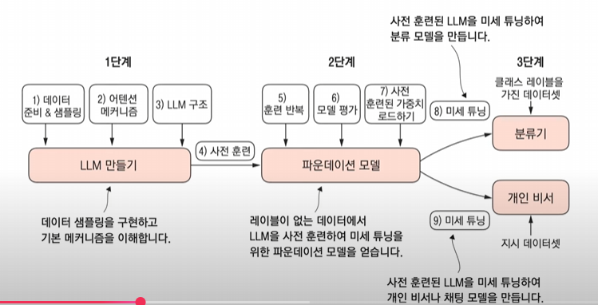

파이토치를 사용해서 어텐션부터 메커니즘을 이용하여
모델을 직접 만들어 본다. 

파이썬 머신러닝과 딥러닝을 다 담은 책을 번역한 사람이다.

llm 의 구조 -> 어텐션 메커니즘.

gpt2의 마지막 공개 모델이다.

사전 모델을 베이스 모델 파운데이션 모델 이라고 한다.

이 모델을 미세 튜닝을 한다.

클래스 레이블을 가진 데이터 셋 -> 텍스트 분류를 위한 분류기

개인 비서 -> 프롬프팅을 이용해서 응담을 하는 모델

지시 미세 튜닝.

깃허브 예제 코드가 있다.
https://github.com/rickiepark/llm-from-scratch

자세한 정보 : https://tesorflow.blog/llm-from-scratch

책에 코드 설명이 잘 되어 있으니 깃허브와 책을 잘 본다!

해설강의도 있으니 그것도 본다!

카톡방도 운영중이다 ( 카톡방 들어가 있다.)

독서 완주 챌린지 이다 8주동안 완독하는것을 목표로 한다.

각 주마다 과제도 있고 인증을 해야한다.

# 왜 이 책을 공부해야 하나?

llm을 만드는것을 꼭 공부해야되나?
-> 활용하는데만 초점이 맞춰져 있다.

작은 팀에서는 만들기 어렵다.

모든 사람에게 적용되진 않지만 참고삼아 들어봐라

학교에서는 만들지도 않을 것을 공부하지만 작동방식을 공부한다 이것도 마찬가지다.

이것도 작동박식을 알고잇으면 도움이 될것이다.

발전되는 내용을 따라가지 못한다.

지금 신경망 내용을 이해하는데 어렵다.

고로 따라가기 위해서 공부하는것이다.

사석에서 하는 말은 그냥 궁금하지 않나요? 이다. 

이걸 사용함으로서 어떤 생산성을 높힐수 있는지

세상은 계획했던 대로 흘러가지 않는다. 세상은 단순하게 굴러가지 않는다 고로 준비해놔야된다.

다양한 시도를 해보는것이 좋다. 대학생때 만화 아르바이트 한적이 있다. 이 경험이 책을 쓸때 삽화를 넣을수 잇는 경험이 되었다. 삽화를 넣을 일을 염두해 두고 아르바이트를 한것이 아니기 때문에 다양한 것을 해보고 시도해보라.