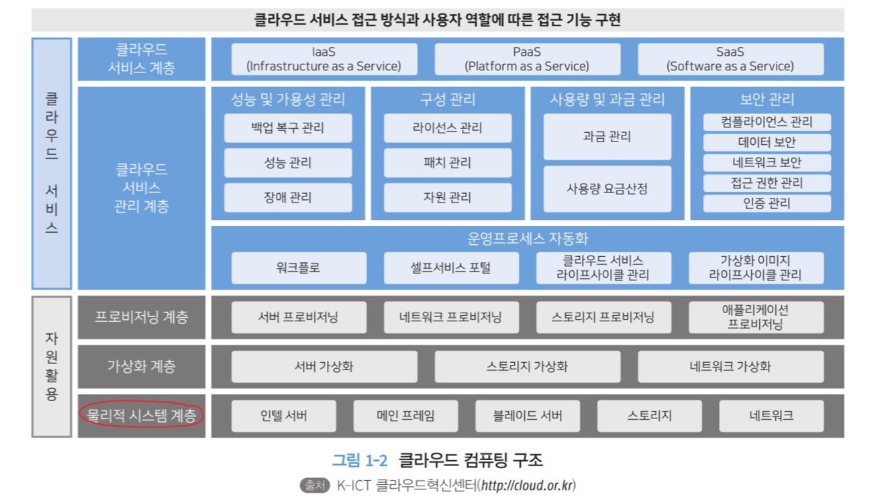
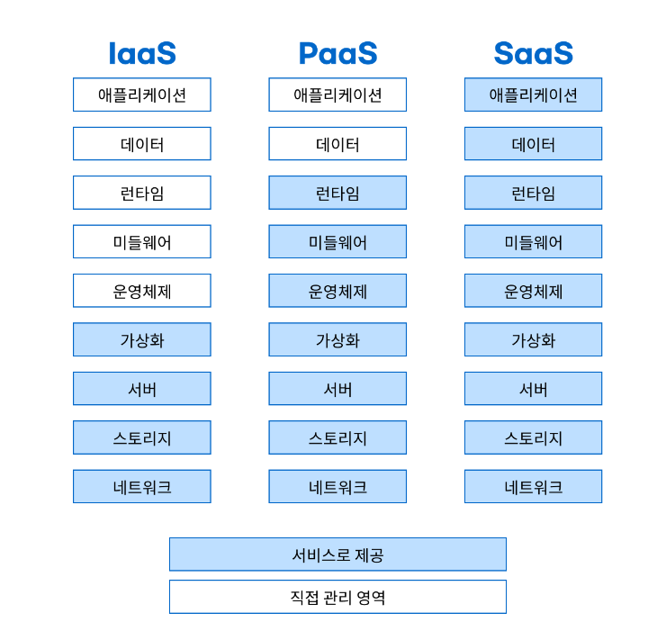

# 1.클라우드 컴퓨팅

## 1.1 클라우드 컴퓨팅 개요

- 클라우드는 인프라에 사용되는 서버 저장소 데이터베이스 네트워크 소프트웨어 데이터 분석등을 포함해 사용자가 언제든지 인터넷과 모바일등의 엔드 디바이스를 통해 IT 서비스를 제공받을수 있는 컴퓨팅 기술이다.
- 애자일 방법론을 활용한 민첩한 서비스 도입과 탄력적인 확장과 축소 자동화된 서비스 유지 관리를 통해 운영 비용을 낮추고 비즈니스 요구사항의 변화를 빠르게 적용할 수 있는 환경을 제공한다.

### 1.1.1 클라우드 컴퓨팅이란?

- 인터넷 기술을 이용해서 다수의 사용자에게 하나의 서비스로서 방대한 IT 능력을 제공하는 컴퓨팅 방식
- 시작은 유틸리티 컴퓨팅 이다. 서비스 제공자 (provider)가 고객에게 컴퓨팅에 사용되는 여러 자원과 기반 시설 등의 관리를 제공하는 형태

- 클라우드 컴퓨팅 = 그리드 컴퓨팅 + 유틸리티 컴퓨팅

- 그리드 컴퓨팅
    - 가상 네트워크를 이용하여 분산된 컴퓨팅 자원을 공유하도록 하는 기술 방식( 인터넷의 유휴 자원을 활용)

- 유틸리티 컴퓨팅
    - 다양한 컴퓨팅 자원에 대한 사용량에 따라 요금을 부과하는 종량제 방식의 기술 기반으로 필요할때 가져다 쓴다는 on - demand 컴퓨팅 방식 (기업 중심의 서비스)

- 클라우드 컴퓨팅
    - 기술적으로는 그리드 컴퓨팅을 따르고 비용적으로는 유틸리티 컴퓨팅을 혼합한 포괄적인 패러다임이다
    - 기업과 개인이 모두 사용 가능한 서비스
    - 클라우드 서비스를 제공하는 사업자의 컴퓨팅 자원 이용

    - 주문형 셀스 서비스 (on-demand self-service) : 고객이 provider의 개입 없이 원하는 시점에 바로 서비스를 사용 할 수 있다..
    - 광대역 네트워크 접근(broad network access) : cloud service provider가 제공하는 광대역 네트워크를 이용하여 빠른 속도로 서비스를 이용할수 있다
    - 신속한 탄력성과 확장성(rapid elasticity and scalability) : auto scaling 기능을 통해 확장과 축소가 가능하다
    - 자원의 공동 관리 resource pooling : 물리적 및 가상화된 자원을 pool로 관리하며 탄력적으로 사용자의 요구에 따라 동적으로 할당 또는 재할당 한다
    - 측정 가능한 서비스 measured service : 자원 사용량이 실시간으로 수집되는 요금 산정 metering 기능을 통해 비용이 발생

### 1.1.2 클라우드 컴퓨팅 구조

- 클라우드 컴퓨팅 구조는 최하위 계층으로 자원 활요ㅕㅇ과 관련된 물리적 시스템 계층 가상화 계층 프로비저닝 계층이 있고 클라우드 서비스와 관련된 클라우드 서비스 관리 계층 클라우드 서비스 계층으로 구분한다.

- 물리적 시스템 계층
    - 여러 형태의 서버를 활용하여 서버에 탑재된 수평적으로 확장 가능한(Scale out) 스토리지 및 네트워크 등의 물리적 요소를 의미
    - 이를 기반으로 서버, 스토리지, 네트워크 가상화는 클라우드의 주요 이점 중 하나인 민첩성(agility)를 제공, 이를 통해 provider는 서버 프로비저닝 또는 프로비저닝 해제를 수행해여 사용자의 요구를 충족
    - 쉽게 말해 사용자가 원하는만큼의 자원을 할당 및 해제해주는 계층
- 가상화 계층
- 프로비저닝 계층
- 클라우스 서비스 관리 계층
    - 물리적 시스템 계층에서 제공되는 자원에 대한 전반적인 라이프 사이클 관리와 모니터링을 지원한다.
- 클라우드 서비스 계층
- 클라우드 접근 계층

### 1.1.3 클라우드 컴퓨팅 제공 방식과 클라우드 서비스 종류
- 클라우드 제공 방식
    - 1. 온프레미스
        - 클라우드 개념이 도입되기 전에 기업들은 자체적으로 데이터 및 솔루션등을 저장하기 위해 로컬에 저장
        - 이를 on premise라고 한다.
        - 이는 탄력적이지 않는 자원과 초기 비용이 비싸다.
        - 보안성은 있다.
        - on premise 방식으로 설계시 자원 사용량은 최대 사용량을 근거로 설계한다.

    - 2. 퍼블릭 클라우드 
        - 인터넷을 통해 다수의 사용자에게 provider가 서버 등의 자원을 제공하는 방식이다.
        - 사용량에 따라 요금을 산정하는 방식이다.
        - 사용자 및 그룹 단위로 권한 관리를 하기 때문에 격리가 되어 사용자 간의 간섭이 되지 않는다
        - 대표적인 서비스로 IaaS, PaaS, SaaS가 있다.

    - 3. 프라이빗 클라우드
        - 제한된 네트워크에서 특정 사용자나 기업만을 대상으로 하는 클라우드 서비스 방식
        - 클라우드 자원과 데이터는 기업 내부에 저장되고 유지 관리에 대한 책임또한 기업이 가짐
        - 인터넷이 아닌 인트라넷 방식

    - 4. 하이브리드 클라우드
        - 퍼블릭 클라우드와 프라이빗 클라우드를 네트워크를 통해 결합하여 두가지 서비스의 장점을 활용
        - 다른 클라우드간 데이터 공유 이동이 자유로움
        - 보안성 데이터는 프라이빗에 그렇지 않은 데이터는 리소스 조정이 가능한 퍼블릭 클라우드를 사용

- 클라우드 서비스의 종류
    

    - 1. 서비스로서의 인프라 스트럭쳐 (infrastructure as a service, IaaS)
        - 가상화, 서버, 스토리지, 네트워크 영역을 서비스로 제공한다.
        - 서버, 스토리지, 네트워크와 같은 인프라 하드웨어 자원을 가상화 하여 사용자 요구에 따라 인프라 자원을 사용하게 해주는 서비스 방식이다.
        - 자동화, 신속한 확장성, 사용량에 따라 비용을 지불
        - KT, LGU+, AWS, GCP, Azure, 오라클 클라우드 플랫폼등에서 Iaas를 사용
        

    - 2. 서비스로서의 플랫폼(platform as aa Service, PaaS)
        - 런타임, 미들웨어, 운영체제, 가상화, 서버, 