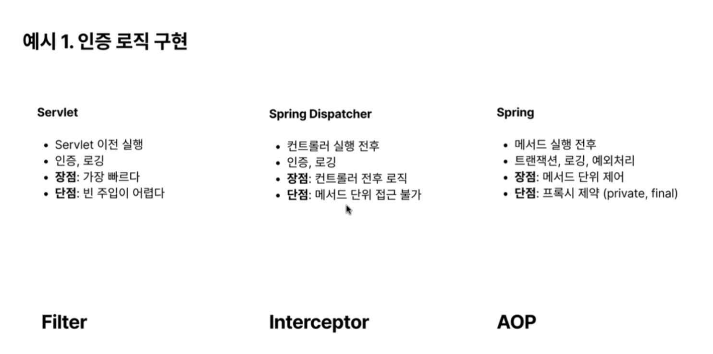
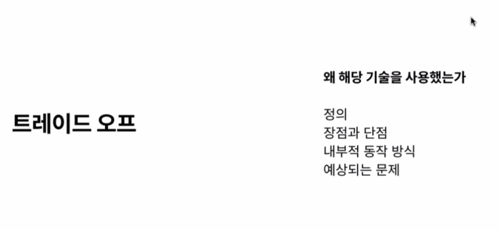
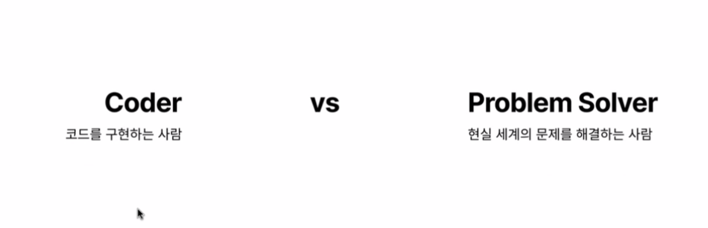
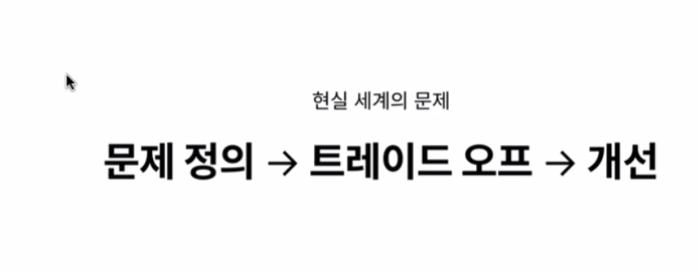
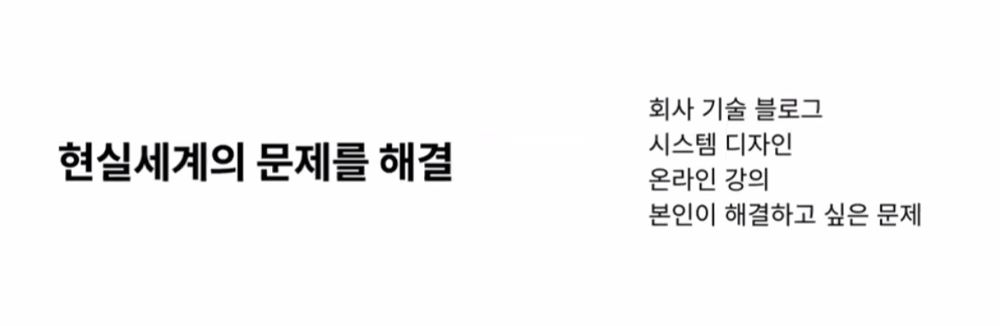
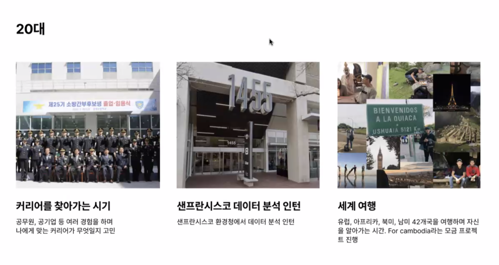
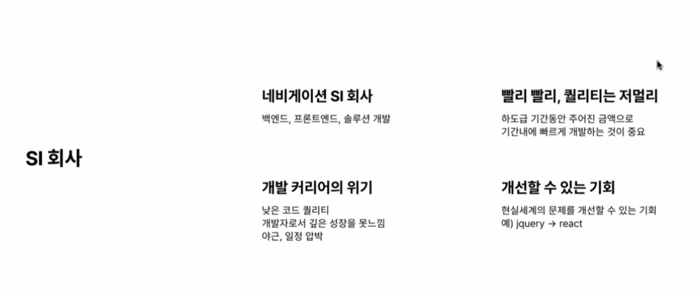
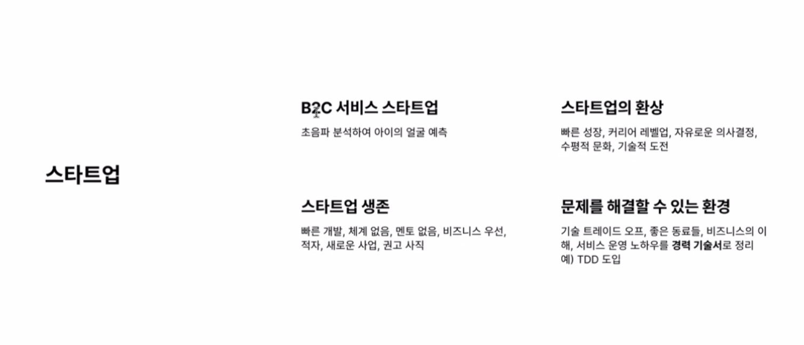
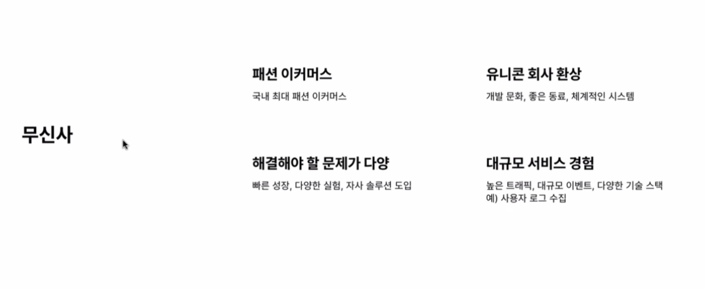

대규모는 servlet 

기술들을 사용할때 왜 이걸 사용했는지 끊임없이 고민한다.

coder 는 ai에게 대체된다.

Problem Solver 를 지향하자.

본인만의 문제를 정의 혹은 다른사람과 소통해 문제를 정의

트레이드 오프를 계속 고민

마지막으로 개선하는 과정

현재 취업 시장에서 원하는 능력일것이다.

비전공자에서 개발자로 

데이터 분석 엑셀을 가지고 간단하게

엑셀보다 자동화를 할수 있다. 라는 이야기를 듣고 개발자에 관심을 가지게 되었다.

활동들이 도움이 안된것은 없다.

너무 이론에 매몰 되어 있던거 같다.

기초를 쌓기에는 턱없이 부족한 시간이다.

광범위하게 보는거보다 지엽적으로 깊게 공부하는게 더 좋다.

현실생활에 해결할 프로젝트, 시스템 디자인등

동시성 이슈나 락을 사용한다던가 하는 쿠폰발급 시스템

SI는 빠르게 주어진기간동안 주어진 예산으로 구현을 해야한다.

개발 커리어에 위기가 생긴다.

코드를 작성하긴 하지만 퀄리티가 낮고 고민할게 없다.

개발자로서 성장을 하고 있나
야근 당연

개선한 경험이 있다면 그건 좋은 경력의 한줄이 되지 않을까 한다.

백엔드 개발자 Front 를 시킴.

비슷한 컴포넌트 view 재활용 react 처럼 만들면 어떨까 j - query 를 리덕스 전역적 상태 관리 툴
내부적으로는 이벤트 방식으로 view를 렌더링하는

start up AI 초음파를 이용하 아이의 얼굴을 예측하는 

start up 의 목적 본질은 생존이다 투자를 받는게 목적.
 주주들의 영향을 많이 받는다.

 buisness 적인 의사 결정을 많이 바꾼다.

 mento 가 없는경우거나 엄청 바쁜 경우가 많다

개발 보다는 비즈니스 적인게 우선

문제를 해결해야될게 있으면 기능을 붙히고 유지보수하게 고민을 끊임없이 한다.

대규모 서비스 경험하면 실력이 는다.
높은 트래픽이나 대규모의 아키텍쳐가 있으면 정말 많은 고민을 해야한다.

